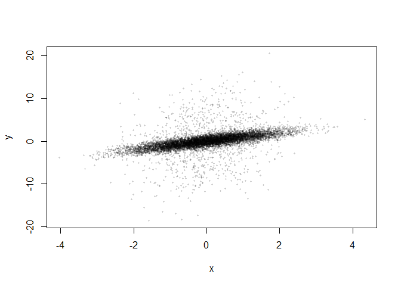
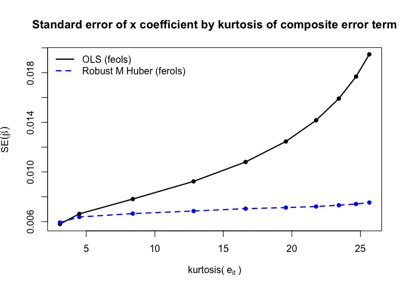

# ferols: A Fixed-Effects Robust M Estimator with Huber Loss


**ferols** provides an experimental implementation for a fixed-effects
linear regression estimator using **Huber M-estimation** with
**iteratively reweighted least squares (IRLS)**. It is inspired by the
[package `robtwfe` by David
Veenman](https://github.com/dveenman/robtwfe). It is build on and
designed to integrate tightly with the
[`fixest`](https://lrberge.github.io/fixest/) ecosystem.

It builds on our recent work

> Joachim Gassen and David Veenman (2026): Estimation Precision and
> Robust Inference in Archival Research, SSRN Working Paper,
> http://dx.doi.org/10.2139/ssrn.4975569.

and combines robust M-estimation (Huber loss) with:

- high-dimensional fixed-effect absorption,
- fast estimation via `fixest::feols`,
- several algorithms to estimate scale in the first step,
- and a `fixest` style variance–covariance interface allowing for
  one-way clustered Huber sandwich standard errors.

## Why?

Standard fixed-effects estimators are sensitive to outliers and
heavy-tailed error distributions. While `fixest` provides fast and
reliable estimation for large linear models with fixed effects, it does
not currently offer robust estimators.

The `ferols` package is a first step to fill this gap. It is intended to
be useful for settings with high-dimensional fixed effects (e.g. panel
data with unit and time effects) and offers robust inference via Huber
ψ/φ sandwich variance estimators, including clustered standard errors.

## Disclaimer

`ferols` is not meant to replace [established R packages for robust
regression](https://cran.r-project.org/web/views/Robust.html) as these
provide much more flexible, tested, and rigorous implementations. Rather
it aims to fill a narrow gap as these packages currently do not allow to
absorb fixed effects during estimation and might thus run in
performance/convergence problems in setting with many fixed effects.

This package is under active development.  
The API, implementation details, and numerical behavior may and probably
will change. Use with care and **do not rely on it to generate
reproducible empirical results yet**.

## Installation (development version)

`ferols` is not on CRAN. To install the current development version from
GitHub:

``` r
install.packages("remotes")
remotes::install_github("joachim-gassen/ferols")
```

## Function to generate test panel data

For convenience, the package ships with the function
`generate_panel_data()`. It generates panel data with a composite error
term that has high kurtosis by default. The modeled data generating
process is as follows

$$
y_{it} = \alpha_i + \lambda_t + x_{it}\beta + z_{it}\gamma + e_{it}
$$

where $\alpha_i$ and $\lambda_t$ are unit and time fixed effects,
respectively. The composite error is constructed as

$$
e_{it} = u_{it} + r_{it} + \eta_{it}
$$

with three components:

- **Unit component** ($u_{it}$): follows an AR(1) process over time
  within each unit (serial correlation within units)

- **Time component** ($r_{it}$): follows an AR(1) process over units
  within each time period (cross-sectional dependence within time)

- **Idiosyncratic component** ($eta_{it}$): i.i.d. noise

This construction induces two-way dependence consistent with the
simulation logic in Petersen (2009).

To generate heavy-tailed errors, a share $p$ of observations is randomly
selected. The composite errors $e_{it}$ of these observations are
multiplied by a factor $m$. This produces a mixture error distribution
with outliers.

## Example code

``` r
library(ferols)
library(moments)
df <- generate_panel_data(seed = 42, e_mult = 10)
cat(sprintf("Kourtosis of composite error: %.2f", kurtosis(df$e)))
```

    Kourtosis of composite error: 24.83

``` r
plot(
  df$x, df$y, xlab = "x", ylab = "y", 
  pch = 16, cex = 0.4, col = rgb(0, 0, 0, 0.2)
)
```



``` r
ferols(y ~ x + z | i + t, data = df, vcov = ~ i)
```

    ferols() - Fixed-effects robust IRLS M regression (Huber loss)
      efficiency: 95.0% | k: 1.3450 | scale est: lad_mm_rsc | scale: 0.8786 | iter: 16
    OLS estimation, Dep. Var.: y
    Observations: 10,000
    Weights: w
    Fixed-effects: i: 1,000,  t: 10
    Standard-errors: Clustered (i) 
      Estimate Std. Error   t value  Pr(>|t|)    
    x 1.003965   0.007369 136.24568 < 2.2e-16 ***
    z 0.012563   0.007349   1.70941  0.087409 .  
    ---
    Signif. codes:  0 '***' 0.001 '**' 0.01 '*' 0.05 '.' 0.1 ' ' 1
    RMSE: 0.900111     Adj. R2: 0.575471
                     Within R2: 0.530222

``` r
# For comparison: OLS has higher standard errors
fixest::feols(y ~ x + z | i + t, data = df, vcov = ~ i)
```

    OLS estimation, Dep. Var.: y
    Observations: 10,000
    Fixed-effects: i: 1,000,  t: 10
    Standard-errors: Clustered (i) 
      Estimate Std. Error  t value  Pr(>|t|)    
    x 1.030946   0.017656 58.38915 < 2.2e-16 ***
    z 0.041022   0.018014  2.27730  0.022979 *  
    ---
    Signif. codes:  0 '***' 0.001 '**' 0.01 '*' 0.05 '.' 0.1 ' ' 1
    RMSE: 1.74302     Adj. R2: 0.284435
                    Within R2: 0.240686

## A comparison of the precision of OLS and robust M by increasing kurtosis of e

``` r
library(ferols)
library(fixest)
library(moments)

multiplers <- 1:10
res <- matrix(NA_real_, nrow = length(multiplers), ncol =  4)
colnames(res) <- c("m", "k_e", "se_x_feols", "se_x_ferols")
res[,1] <- multiplers
for (r in 1:nrow(res)) {
  df <- generate_panel_data(seed = 1234, e_mult = res[r, "m"])
  res[r, "k_e"] <- kurtosis(df$e)
  fit_ols <- feols(y ~ x + z | i + t, vcov = ~i, data = df)
  res[r, "se_x_feols"] <- fit_ols$se[1]
  fit_rols <- ferols(y ~ x + z | i + t, vcov = ~i, data = df)
  res[r, "se_x_ferols"] <- fit_rols$se[1]
} 
plot(
  main = "Standard error of x coefficient by kurtosis of composite error term",
  res[, "k_e"], res[, "se_x_feols"], type = "l", 
  xlab = bquote("kurtosis("~ e[i*t] ~ ")"), ylab = expression(SE(hat(beta))), 
  lwd  = 2, 
)
lines(
  res[, "k_e"], res[, "se_x_ferols"],
  lwd = 2, lty = 2, col = "blue"
)
points(res[, "k_e"], res[, "se_x_feols"], pch = 16)
points(res[, "k_e"], res[, "se_x_ferols"], col = "blue", pch = 16)
legend(
  "topleft",
  legend = c("OLS (feols)", "Robust M Huber (ferols)"),
  lty = c(1, 2), col = c("black", "blue"), lwd = 2, bty = "n"
)
```



## Not yet implemented (sorted by priority)

- Multi-way clustering
- Alternative loss functions
